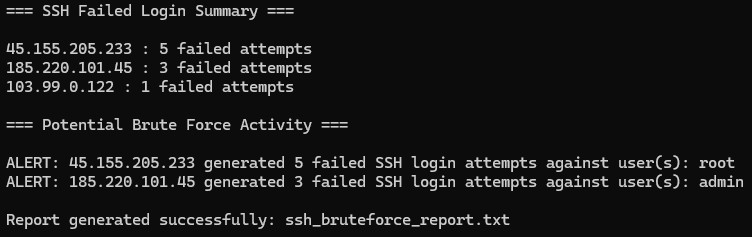

# Brute Force SSH Hunter

## Project Overview

This project simulates a Security Operations Center (SOC) investigation by analyzing Linux SSH authentication logs to detect potential brute force attacks.

## Objective

Identify repeated failed SSH login attempts, extract attacker IP addresses, determine targeted usernames, and generate an automated security report.

## Key Features

- Parses Linux SSH authentication logs
- Detects failed SSH login attempts
- Identifies suspicious IP addresses
- Extracts targeted usernames
- Generates an automated security report

## Skills Demonstrated

- Python
- Linux Log Analysis
- SSH Security
- Brute Force Detection
- Threat Detection
- Security Monitoring
- Incident Reporting
- SOC Analysis

## Project Output

Example of the script detecting potential SSH brute force activity and generating an automated report.

